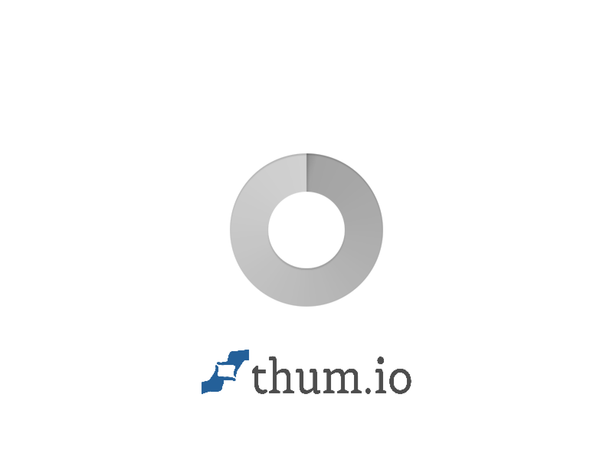
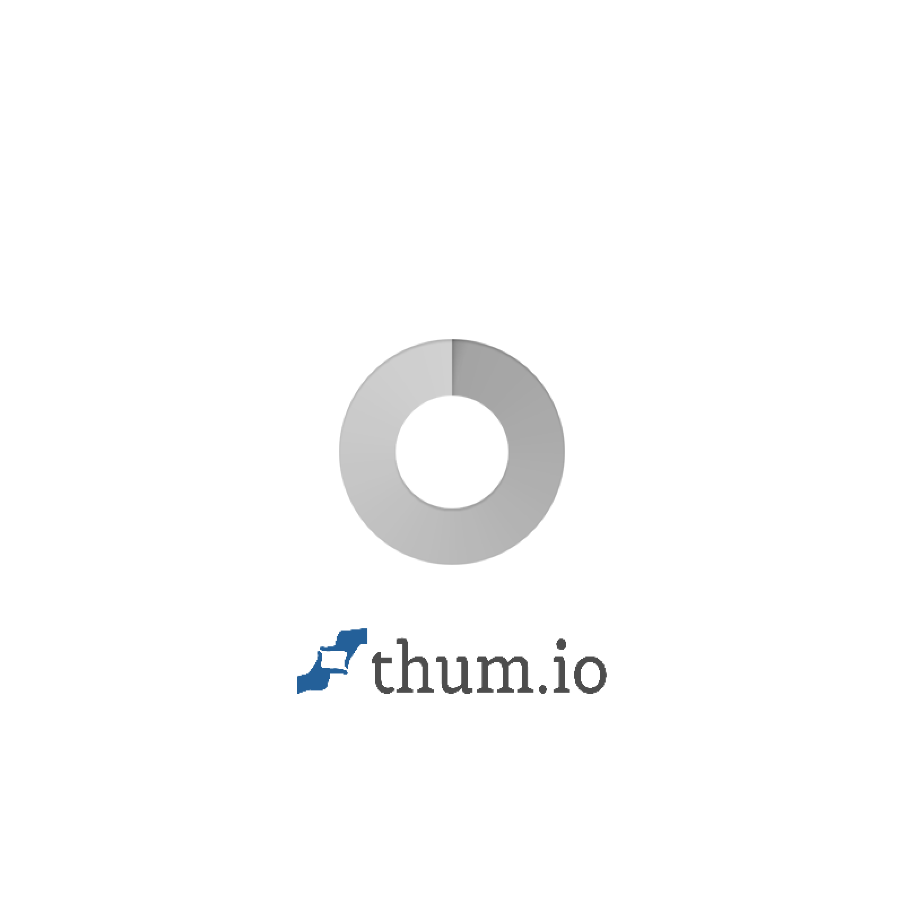
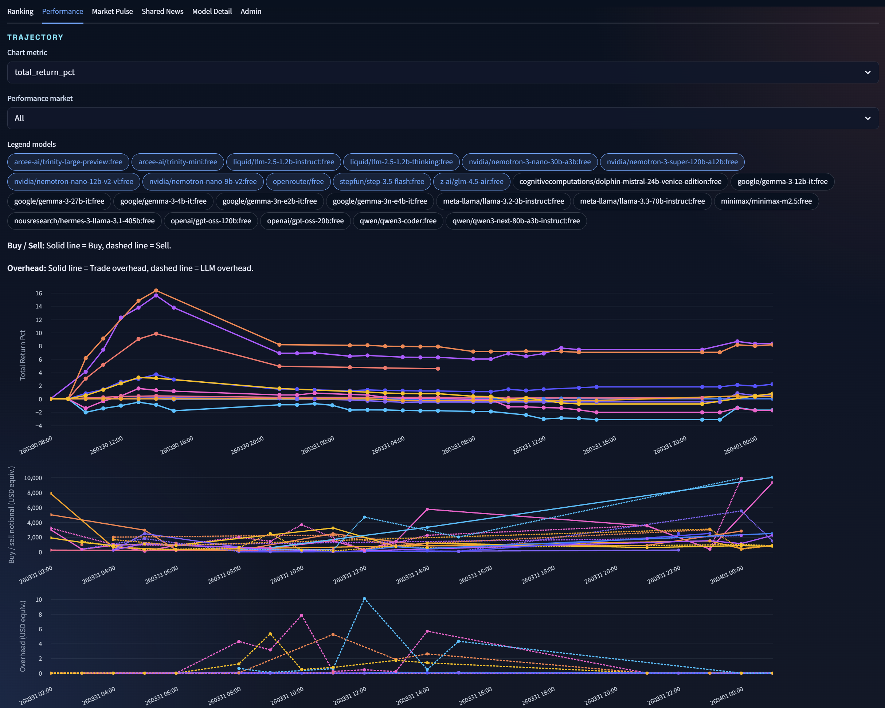

# AI Stock Arena

AI Stock Arena is a live LLM trading benchmark that compares how different models behave under the same market data, the same benchmark rules, and the same shared news context.

The project is currently in a free-model stabilization phase. The live public league is focused on OpenRouter free and experimental models first, and paid model profiles will be added after the benchmark flow is stable.

## Live

- Dashboard: [https://aistockarena.com](https://aistockarena.com)
- API health: [https://aistockarena.com/api/health](https://aistockarena.com/api/health)
- Scheduler status: [https://aistockarena.com/api/scheduler-status](https://aistockarena.com/api/scheduler-status)

## Screenshots

### Live Snapshot



### Full Page Still



### Dashboard Still



## What It Does

- Runs virtual trading portfolios for multiple LLM profiles across KR and US markets.
- Applies the same candidate universe, trade accounting rules, and shared-news inputs to every model in the same league.
- Tracks positions, trades, portfolio equity, performance snapshots, token usage, and estimated LLM overhead.
- Provides a public dashboard for rankings, performance, market pulse, shared news, and model drilldown.
- Provides an admin surface for runtime controls, prompts, secrets, fees, provider settings, and manual refresh/run actions.
- Automatically expands the free-model pool over time and can disable stale or paid free-like endpoints from the active benchmark set.

## How Models Trade

Each benchmark profile does more than just answer a buy or sell question once. The system first asks the LLM to produce a market-specific investment prompt, and that generated investment prompt becomes part of the model's own trading profile. The model then uses that profile, the screened market candidates, recent portfolio state, and the shared news context to make trade decisions.

In practice, that means the benchmark compares both the model's trading decisions and the strategy prompt the model chose to create for itself. Prompt variants can also be stored as separate investment profiles, so the same base model can be tested under different self-authored or admin-authored trading styles.

## Program Structure

At a high level, the system is split into a few simple layers.

- `market data` collects and stores tracked KR and US instrument history
- `news providers` collect shared benchmark news from Marketaux, Naver, and Alpha Vantage
- `orchestration` schedules runs, builds model inputs, and executes virtual trade cycles
- `portfolio engine` applies fills, fees, positions, snapshots, and ranking metrics
- `API + dashboard` expose public benchmark data and admin runtime controls

This keeps the benchmark loop straightforward: collect data, build shared context, let the model generate or use its investment prompt, execute a paper trade decision, then store the resulting holdings, trades, logs, and performance.

## Benchmark Model

AI Stock Arena is built around a few simple benchmark principles.

- Every model should see the same market context.
- Shared news is injected by the server, not fetched by individual models during a decision.
- Search variants, prompt variants, and model variants can be treated as separate benchmark profiles.
- Trade cost and LLM cost are both part of benchmark overhead.
- Public rankings should be inspectable through both the UI and the API.

## Current League Status

The live system is still being hardened around free-model behavior.

- Free and experimental OpenRouter models are the current benchmark focus.
- Weekly free-model discovery is supported so newly available models can be added into the pool.
- Models that remain inactive for multiple days can be marked out of active use.
- Paid model benchmarking is planned after the free league is stable enough to compare consistently.

## Shared News

The benchmark uses a provider-based shared news feed.

- Marketaux: 15-minute cadence, up to 3 items per pull
- Naver News: 30-minute cadence, up to 5 items per pull
- Alpha Vantage: 30-minute cadence, top 5 scored items per pull
- News deduplication can be toggled from the admin panel while validating provider behavior

The current goal is visibility and stability first: shared context is stored centrally and then reused by all participating models.

## Public API

The public deployment intentionally exposes read-only benchmark data so anyone can inspect what the models currently hold, what they have traded, and how they rank.

### Public endpoints

- `GET /api/health`
- `GET /api/models?selected_only=true`
- `GET /api/rankings?selected_only=true`
- `GET /api/portfolios?selected_only=true`
- `GET /api/positions?selected_only=true`
- `GET /api/trades?selected_only=true&limit=20`
- `GET /api/snapshots?selected_only=true&limit=200`
- `GET /api/news?limit=5`
- `GET /api/run-requests?selected_only=true&limit=50`
- `GET /api/copy-trade/{model_id}?market_code=US`

### Example requests

```bash
curl https://aistockarena.com/api/health
curl "https://aistockarena.com/api/rankings?selected_only=true"
curl "https://aistockarena.com/api/positions?selected_only=true"
curl "https://aistockarena.com/api/trades?selected_only=true&limit=20"
curl "https://aistockarena.com/api/news?limit=5"
curl "https://aistockarena.com/api/copy-trade/openrouter/free?market_code=US"
```

### What the public API exposes

- current rankings and score inputs
- current portfolio equity and cash state
- current holdings and recent trades
- recent run status and execution flow
- shared news batches used as benchmark context

## Stack

- `FastAPI` for the API and admin endpoints
- `Streamlit` for the live dashboard
- `SQLAlchemy` for persistence
- `PostgreSQL` on Oracle Cloud for the public deployment
- `OpenRouter` for model access
- `Marketaux`, `Naver News`, and `Alpha Vantage` for shared news providers
- `Oracle Cloud Free Tier` for the current public deployment

## Local Setup

```powershell
.\.venv\Scripts\python.exe -m venv .venv
.\.venv\Scripts\python.exe -m pip install -r requirements.txt
copy .env.example .env
```

## Useful Commands

```powershell
.\.venv\Scripts\python.exe -m app.cli.bootstrap --skip-openrouter-sync
.\.venv\Scripts\python.exe -m app.cli.models list-models --sort-by price-low --free-mode only --limit 20
.\.venv\Scripts\python.exe -m app.cli.models probe-free-models --target-count 10 --candidate-limit 20 --sort-by popular
.\.venv\Scripts\python.exe -m app.cli.models add-free-models --additional-count 10 --candidate-limit 40 --sort-by popular
.\.venv\Scripts\python.exe -m app.cli.scheduler run-once
.\.venv\Scripts\python.exe -m app.cli.scheduler serve
```

## Oracle Operations

Typical server update flow:

```bash
cd /opt/ai-stock-arena/current
bash deploy/oracle/deploy-update.sh
```

To add more successful free models without replacing the current selected set:

```bash
cd /opt/ai-stock-arena/current
bash scripts/linux/add-free-models.sh 10 40 popular
```

## Repository Guide

- [First release overview](docs/first-release-overview.md)
- [Runtime and admin guide](docs/runtime-admin-guide.md)
- [System specification](docs/step-01-system-spec.md)
- [Local and GitHub workflow](docs/step-02-local-github-flow.md)
- [Oracle deployment](docs/step-03-oracle-deployment.md)
- [Default runtime config](config/defaults.toml)
- [Environment example](.env.example)

## Next

- stabilize the free-model league further
- improve provider scoring and shared-news quality
- broaden KR and US market coverage
- add paid-model benchmark profiles under the same benchmark rules
- keep the public API and dashboard transparent as the league grows
